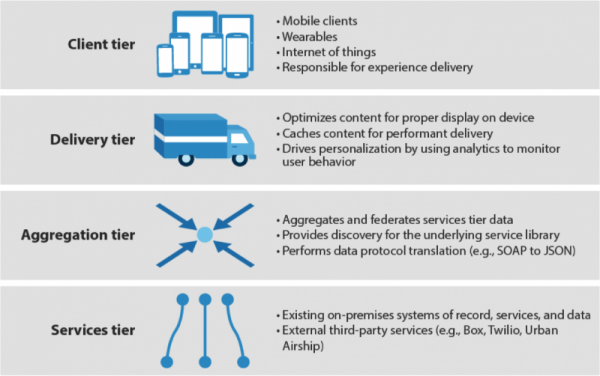

# Nine Chapter System Design

Detailed notes see the slides. Here are materials missing form the slides.

## Lecture 1

### Design Netflix

Excerpt from [Mobile Needs A Four-Tier Engagement Platform](https://go.forrester.com/blogs/13-11-20-mobile_needs_a_four_tier_engagement_platform/)

How the four tiers handle the load:

__A client tier accounts for the unique attributes of different devices.__ This
presentation layer insulates the unique capabilities of each app and device —
desktop or mobile, browser or dedicated app — from the services that back-end
applications deliver. This boundary allows developers to create back-end
services like flight status and shipment notification independent of the mobile
app that will consume them. Creating this clear boundary drives productivity for
your developers without an onerous maintenance challenge; it will be critical
for a fluid business partner network.

__A delivery tier handles special middle- and last-mile challenges.__ This
element uses intelligence from the client layer to determine the optimal way to
deliver contextually appropriate content. The delivery tier accomplishes this by
using over-the-wire content transformation — as opposed to protocol-based
conversions at the next aggregation layer — and leveraging edge-of-network cache
functionality for increasingly dynamic data. CDNs such as those provided by
Akamai, along with delivery optimization solutions like Instart Logic,
application delivery controllers like Riverbed Stingray, and on-premises
in-memory database caches, fulfill this today.

__An aggregation tier integrates internal and external services and transforms
data.__ This API layer has two brokerage roles, providing discoverability
between app requests and services and bidirectional translation between client
requests and back-end or third-party services. This makes composing the
underlying data and services easier and enables relatively simple real-time
translation to the appropriate data format. The service composition becomes more
dynamic with the addition of business intelligence, analytics, and role-based
access, which occurs in this tier.

__A services tier spans internally and externally provisioned data and
functionality.__ This final architectural element dynamically composes data and
business processes through a set of continuously deployable services. This tier
provides data to the layers above without concern for how that data is consumed;
the other layers can exist behind the corporate firewall or externally — or
both! This allows for the ultimate flexibility in the consumption and dynamic
composition of services, whether leveraged by apps or by the evolving partner
ecosystem.

### Reference

* [Netflix’s Viewing Data](https://netflixtechblog.com/netflixs-viewing-data-how-we-know-where-you-are-in-house-of-cards-608dd61077da)
* [Mobile Needs A Four-Tier Engagement Platform](https://go.forrester.com/blogs/13-11-20-mobile_needs_a_four_tier_engagement_platform/)
* [NGINX Search Results for: netflix](https://www.nginx.com/?s=netflix)
* [Netflix Tech Blog](https://netflixtechblog.com/)

## Lecture 2 Database systems

### Design user system

Scenario

* [Unique Key](https://en.wikipedia.org/wiki/Unique_key#Defining_primary_keys)