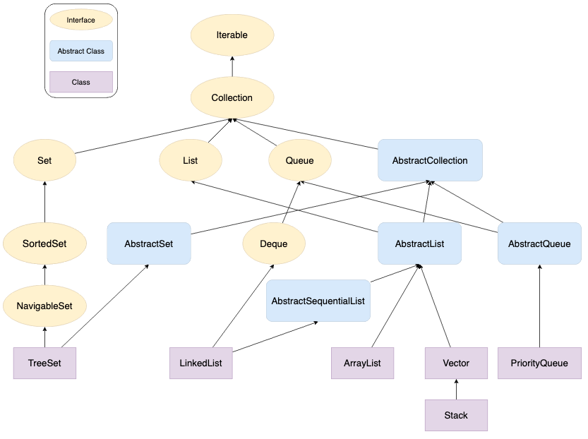

# Java Collections



NB: Course is started with educative.io version and will be expanded the list to include more collection

## Collection v.s. Collections

1. Collection is an interface, collections is a class.
2. A Collection interface provides the standard functionality of a data structure
   to List, Set, and Queue. However, the Collections class provides the utility
   methods that can be used to search, sort, and synchronize collection elements.

## ArrayList

* Default size is 10. Java 8 lazy allocation, 0 on creation, resize to 10 on adding.
* The capacity is checked when added, it reallocate strategy is create $n + n / 2 + 1$.

### Basic Methods

* `List.add(E e)`
* `List.add(int index, E e)`
* `List.addAll(Collection c)`
* `List.addAll(int index, Collection c)`
* `List.get(int index)`
* `List.size()`
* `List.remove(int index)`, e.g. `list.remove(2);`
* `List.remove(Object o)`, e.g. `list.remove(new Integer(2));`
* `List.removeRange(int fromIndex, int toIndex)`
* `List.removeAll(Collection<?> c)`
* `List.clear()`
* `List.replaceAll(UnaryOperator<E> operator)`, e.g. `list.replaceAll((element) -> element.toUpperCase());`
* `List.set(int index, E e)`
* `List.contains(Object o)`
* `List.indexOf(E e)`
* `List.lastIndexOf(E e)`

```java
import java.util.ArrayList;
import java.util.List;

public class ArrayListDemo {
  List list = new ArrayList();
  list.add(1);
  list.add(2);
  list.add(3);
  System.out.println(list);

  list.add(4);
  System.out.println(list);

  list.add(1, 50);
  System.out.println(list);

  List newList = new ArrayList();
  newList.add(500);
  newList.add(600);
  System.out.println(newList);

  list.addAll(newList);
  System.out.println(list);

  list.addAll(1, newList);
  System.out.println(list);
}
// output:
// [1, 2, 3]
// [1, 2, 3, 4]
// [1, 50, 2, 3, 4]
// [1, 50, 2, 3, 4, 150, 160]
// [1, 150, 160, 50, 2, 3, 4, 150, 160]
```

### Using an Iterator

* `Interator<Integer> iter = List.iterator();`
* `iter.hasNext()`
* `iter.next()`
* `iter.remove()`
* `iter.forEachRemaining(Consumer<? super E> action)`
* Once a interator is created, we can not modify the List while interating elements.

```c++
Iterator<Integer> iter = list.iterator();

// remove a element WRONG WRONG
while (iter.hasNext()) {
  int next = iter.next();

  if (next == 30) {
    list.remove(new Integer(30));
  }
}

// CORRECT
while (iter.hasNext()) {
  int next = iter.next();
  if (next == 30) {
    iter.remove();
  }
}

// add an element WRONG WRONG
Iterator<Integer> iter = list.iterator();
list.add(10);
while (iter.hasNext()) {
  System.out.println(iter.next());
}
```

### Using an ListIterator

* `ListIterator<Integer> listIterator = list.ListIterator();`
* `List.hasNext();`
* `List.next();`
* `List.hasPrevious();`
* `List.previous();`
* `List.nextIndex();`
* `List.previousIndex();`
* `List.remove();`, can only be made for each call to `next()` or `previous()`.
* `List.set(E e);`, replace the element returned by `next()` or `previous()`.
* `List.add(E e);`, add before the element returned by `next()`.

### Sort ArrayList

* `Collections.sort(List<T> list)`, type `T` must implement the `Comparable` interface.
* `List<Integer> sortedList = list.stream().sorted().collect(Collectors.toList());`, Java 8.
* `Collections.sort(list, Collections.reverseOrder());`
* `List<Integer> sortedList = list.stream().sorted(Comparator.reverseOrder()).collect(Collectors.toList());`, Java 8.

### Comparable Interface

```java
public class Vehicle implements Comparable<Vehicle> {

  String brand;
  Integer makeYear;

  public Vehicle(String brand, Integer makeYear) {
    super();
    this.brand = brand;
    this.makeYear = makeYear;
  }

  @Override
  public int compareTo(Vehicle o) {
    return this.makeYear - o.makeYear;
    // We can also use the compareTo() method of the Integer class.
    //return this.makeYear.compareTo(o.makeYear);
  }
}
```

### Comparator Interface

* `Collections.sort(List<T> list, Comparator<? super T> c)`.
* Comparator interface has a method, `compare(T o1, T o2)`.

```java
// BrandComparator.java
import java.util.Comparator;

public class BrandComparator implements Comparator<Vehicle> {

  @Override
  public int compare(Vehicle o1, Vehicle o2) {
    return o1.brand.compareTo(o2.brand);
  }
}

// use the comparator in code
Collections.sort(list, new BrandComparator());

// alternatively use anonymous comparator class
Collections.sort(list, new Comparator<Vehicle>() {

  @Override
  public int compare(Vehicle o1, Vehicle o2) {
    return o1.brand.compareTo(o2.brand);
  }
});

// Use Java 8 lambda comparator (functional style)
Collections.sort(list, (o1, o2) -> o1.brand.compareTo(o2.brand));
```