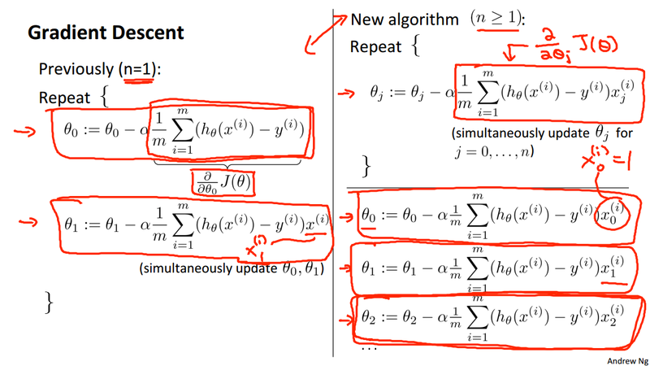
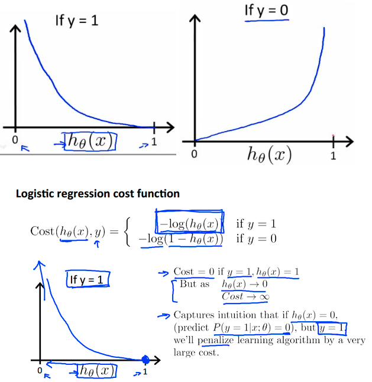
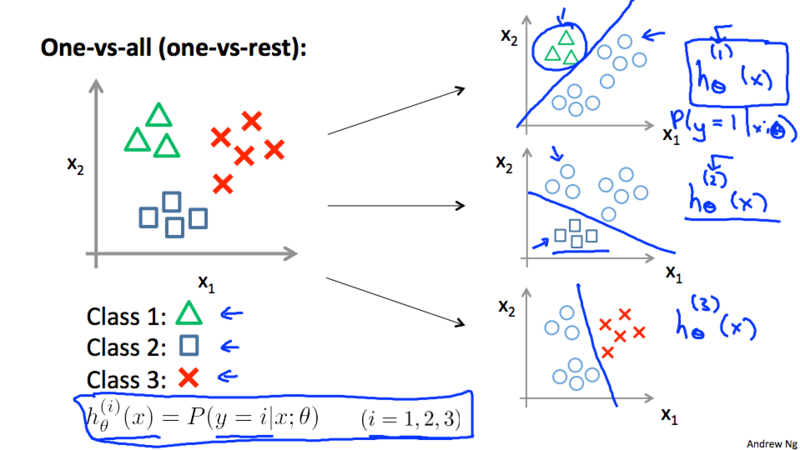
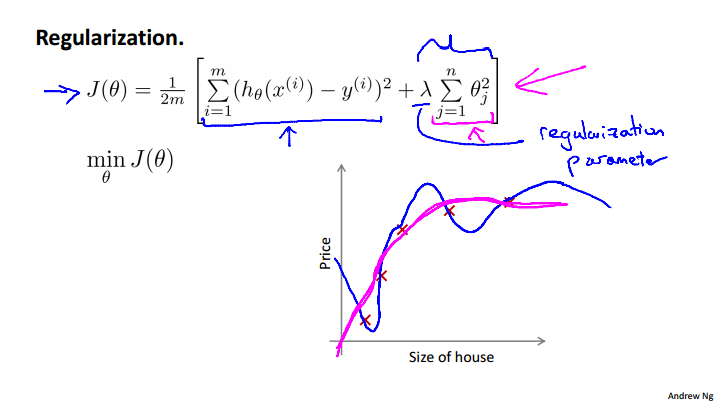

# Machine Learning (Coursera)

## Week 1

### Introduction

!!! qoute
    Machine Learning is a field of study that gives computers the ability to
    learn without being explicitly programmed. -- Arthur Samuel (1959)

!!! qoute
    A computer program is said to learn from experience E with respect to some
    task T and some performance measure P, if its performance on T, as measured
    by P, improves with experience E. -- Tom Mitchell (1998)

- Well-posed Learning Problem
    * Experience **E**
    * Task **T**
    * Performance **P**
- Supervised learning: give the "right answer" of existing
- Unsupervised learning
- Reinforcement learning
- Recommendation system
- **Regression V.S. classification**

    1. Regression, predict a continuous value across range
        - a function of independent variable
    2. Classification, predict a discrete value

### Cost Function

- Cost function (squared error function)

$$J(\theta_0, \theta_1) = \frac{1}{2m}\sum_{i=1}^{m}(h_\theta(x^{(i)}) - y^{(i)})^2$$

- Goal

$$\underset{\theta_0, \theta_1}{\text{minimize}} J(\theta_0, \theta_1)$$

- Some Intuitions

    1. when the sample is `{1, 1}, {2, 2}, and {3, 3}`.
        $h_\theta(x) =  x, (\theta_0 = 0, \theta_1 = 1)$, we can calculate
        $J(\theta_0, \theta_1) = 0.$
    2. when the sample is `{1, 1}, {2, 2}, and {3, 3}`.
        $h_\theta(x) =  0.5 x, (\theta_0 = 0, \theta_1 = 0.5)$, we can
        calculate $J(\theta_1) = \frac{3.5}{6}.$
    3. we can plot $J(\theta_1)$ vs. $\theta_1$, the function plotted would
        be a quadratic curve.

### Cost Function Intuition I

- Andrew plot the hypothesis $\textstyle h_\theta(x)$ and the cost
  function $\textstyle {J(\theta_1)}$（setting $\theta_0 = 0$）, The
  function $\textstyle J(\theta_1)$ is a curve have a minimum
  value.

### Cost Function Intuition II

- The plot of $h(x)$ and $J(\theta_0, \theta_1)$ show that
  $J(\theta_0, \theta_1)$ has to be contour plot.

- Our goal is to $\min_{\theta_0, \theta_1}J(\theta_0, \theta_1)$

To summarize, in this lecture, we formulate the hypothesis function and
defined the cost function. We also plotted them to get some insight into
the two functions. The machine learning problem we learn from this
lecture is a minimization problem. Given a hypothesis, we looking for
the $\theta_0$ and $\theta_1$ which minimize the cost function. Then we
solve the problem. We use the Gradient Descent algorithm to search this
minimum value.

### Gradient Descent

- It could solve general minimization problems
    - Given function $J(\theta_0, \theta_1)$
    - Objective: $\min_{\theta_0, \theta_1}J(\theta_0, \theta_1)$

!!! example "Gradient Descent Algorithm"
    - Start with some $\theta_0, \theta_1$
        - Keep changing $\theta_0, \theta_1$ to reduce $J(\theta_0, \theta_1)$
            - Simultianeously update:
             $\theta_j := \theta_j - \alpha \frac{\partial }{\partial \theta_j}J(\theta_0, \theta_1)$,
             for $( j = 0, j = 1)$
    -   Untill we hopefully end up at the minimum.(convergence)

- Question: How to implement the algorithm.

### Gradient Descent Intuition

- learning rate
    1. don't have to adjust the learning rate
- derivative
    1. would reduce automatically

### Gradient Descent and Linear Regression

- Take the linear regression cost function and apply gradient descent algorithm.
- Model: $h_\theta(x) = \theta_0 + \theta_1x$
- Cost function:
  $J(\theta_0, \theta_1) = \frac{1}{2m}\sum_{i=1}^{m}(h_\theta(x^{(i)}) - y^{(i)})^2$
- Gradient Descent in Linear Regression.

repeat
$\begin{Bmatrix}
\theta_0 := \theta_0 - \alpha \frac{1}{m} \sum_{i = 1}^{m}(h_\theta(x^{(i)}) - y^{(i)})  \\
\theta_1 := \theta_1 - \alpha \frac{1}{m} \sum_{i = 1}^{m}(h_\theta(x^{(i)}) - y^{(i)}) x^{(i)}
\end{Bmatrix}$
simultaneously.

- The linear regression cost function is always a **convex function** - always has a single minimum (bowl Shaped).

### Linear Algebra Review

1. **Not commutative:** A x B != B x A except that matrix B is identity matrix.
2. **Associativity:** (A x B) x C = A x (B x C)
3. **Identity Matrix:**
    - Any matrix **A** which can be multiplied by an identity matrix gives you matrix **A** back
    - I\[m, m\] x A\[m, n\] = A\[m, n\]
    - A\[m, n\] x I\[n, n\] = A\[m,n\]
4. **Inverse**
    - Multiplicative inverse(reciprocal): a number multiply it by to
      get the identify element. i.e. if you have `x`, `x * 1/x = 1`.
    - Additive inverse: -3 is 3's additive inverse.
5. **Matrix inverse**
    - $A \dot A^{-1} = I$
    - Only square matrix, but not all square matrix have inverse.
6. **singularity**
    - If A is all zeros then there is no inverse matrix
    - Some others don\'t, intuition should be matrices that don\'t
      have an inverse are a **singular matrix** or a **degenerate
      matrix** (i.e. when it\'s too close to 0)
    - So if all the values of a matrix reach zero, this can be
      described as reaching **singularity**

## Week 2

### Multiple features(variables) linear regression

1. From feature $x^{(i)}$to features $x_j^{(i)}$, means the $j$th
   feature element of the $i$th feature vector.
2. Hypothesis becomes:
   $\textstyle h_\theta(x) = \theta^{T}x = \theta_0x_0 + \theta_1x_1 + ... + \theta_nx_n$.
3. Cost Function:
   $J(\theta_0, \theta_1, ..., \theta_n) = \frac{1}{2m}\sum_{i=1}^{m}(h_\theta(x^{(i)}) - y^{(i)})^2$
4. Gradient descent:
   $\theta_j := \theta_j - \alpha \frac{\partial }{\partial \theta_j}J(\theta_0, \theta_1, ..., \theta_n)$,
   simultaneously update for every $j = 0, 1, 2, ..., n$.
5. Compare of Gradient descent for multiple variables:
    

### Feature scaling

One of the idea to improve the result in gradient descent is to make
different features in the same scale, i.e. $-1 \leq x_i \leq 1$ range .

For example, in the housing price prediction problem, we have to make
the size of the house (0-2000 square feet), and the number of rooms in
the hourse (1-5 rooms) in the same scale. We do this by the method of
**mean normalization.**

- **Mean normalization** Replace $x_i$ with $x_i - \mu_i$ to
    make features have approximately zero mean (Do not apply to $x_0 = 1$)
    - E.g. $x_1 = \frac{size - 1000}{2000}$,
      $x_2 = \frac{\#rooms - 2}{5(range)}$ to make
      $-0.5 \le x_1 \le 0.5, -0.5 \le x_2 \le 0.5,$

### Learning rate

Another idea to improve gradient descent algorithm is to select the
learning rate $\alpha$to make the algorithm works correctly.

- **Convergence test:** we can declare convergence if
  $J(\theta)$ decreases by less than $10^{-3}$in one iteration.

For sufficient small $\alpha$, $J(\theta)$ should decrease on every iteration,
but if $\alpha$ is too small, gradient descent can be slow to converge.
If $\alpha$ is too large: $J(\theta)$ may not decrease on every iteration, may not converge.

- **Rule of Thumb:** to choose $\alpha$, try these numbers
    `..., 0.001, 0.003, 0.01, 0.03, 0.1, 0.3, 1, ...`

### Polynomial Regression

In the house price prediction proble. if two features selected are
frontage and depth. we can also take the polynomial problem, take the
area as a single feature, thusly reduce the problem to a linear
regression. We could even take the higher polynomials of the size
feature, like second order, third order, and so on. for example,

$h_\theta = \theta_0 + \theta_1x_1 + \theta_2x_2 + \theta_3x_3 = \theta_0 + \theta_1(size) + \theta_2(size)^2 + \theta_3(size)^3$

In this case, the polynomial regression problem will fit in a curve
instead of a line.

### Normal Equation

Normal Equation: Method to solve for θ analytically. The intuition comes
that we can mathematically sovle
$\frac{\partial}{\partial\theta_j}J(\Theta) = 0$ for
$\theta_0, \theta_1, \dots, \theta_n$, given the $J(\Theta)$.

The equation to get the value of $\Theta$ is $\Theta = (X^TX)^{-1}X^Ty$,
in Octave, you can calculate by the command `pinv(X'*X)*X'*y)`, pay
attention to the dimention of the the matrix `X` and `y`.

### Normal equation and non-invertibility

TBD

## Week 3

### Logistic regression model

#### Classification problem

- Email: spam / Not spam?
- Tumor: Malignant / Benign?
- Example:

    

1. y is either 0 or 1
   - 0: Negative class
   - 1: Positive class.
2. With linear regression and a threshold value, we can use linear
   regression to solve classification problem.
3. However linear regression could result in the case when $h_\theta(x)$ is >
   1 or < 0.
4. Need a different method which will make $0 \le h_\theta(x) \le 1$.
   This is why logistic regression comes in.

#### Hypothesis representation

Because we want to have $0 \le h_\theta(x) \le 1$, the domain of sigmoid
function is in the range. From linear regression
$h_\theta(x) = \theta^Tx$, we can have $h_\theta(x)$ for logistic
regression:

$$h_{\theta}(x) = g_\theta(\theta^Tx) = \frac{1}{1 + e^{-\theta^Tx}}, 0 \le h_\theta(x) \le 1$$

$g_\theta(z) = \frac{1}{1 + e^{-z}}$ is [Sigmoid function](https://en.wikipedia.org/wiki/Sigmoid_function), also called
logistic function. now in logistic regress model, we can write

$$h_\theta(x) = \frac{1}{1 + e^{-\theta^Tx}}.$$

#### Interpretation

- Logistic regression model
  $h_\theta(x) = \frac{1}{1 + e^{-\theta^Tx}},$ is the estimated
  probability that y = 1 on input x. i.e. $h_\theta(x) = 0.7$ tell
  patient that 70% chance of tumore being malignant.
- $h_\theta(x) = P(y = 1|x;\theta)$,
- $P(y=0|x; \theta) + P(y=1|x;\theta) = 1$

### Logistic regression decision boundary

1. Gives a better sense of what the hypothesis function is computing
2. Better understanding of what the hypothesis function looks like
   - One way of using the sigmoid function is:
       - When the probability of y being 1 is greater than 0.5 then
         we can predict y = 1
       - Else we predict y = 0
   - When is it exactly that $h_\theta(x)$ is greater than 0.5?
       - Look at sigmoid function
           - g(z) is greater than or equal to 0.5 when z is greater than or equal to 0.
       - So if z is positive, g(z) is greater than 0.5
           - $z = (\theta^T x)$
       - So when
           - $\theta^T x >= 0$
       - Then $h_\theta(x) >= 0.5$
3. So what we've shown is that the hypothesis predicts y = 1 when $\theta^T x >= 0$
    - The corollary of that when $\theta^T x <= 0$ then the hypothesis predicts y = 0
    - Let's use this to better understand how the hypothesis makes its predictions
4. Linear Decision boundary and non-linear decision boundary
    
    

## Logistic regression cost function

### Problem description


### Logistic Regression Cost Function

Out goal to solve a logistic regression problem is to reduce the cost
incurred when predict wrong result. In linear regression, we minimize
the cost function with respect to vector $\theta$. Generally, we can
think the cost function as a penalty of the incorrect classification. It
is a qualitative measure of such penalty. For example, we use the
squared error cost function in linear regression:

$J(\theta) = \frac{1}{2m}\sum_{i=1}^{m}(h_\theta(x^{(i)}) - y^{(i)})^2$.

In logistic regression, the $h_\theta(x)$  is a much complex function,
so the cost function $J(\theta)$ used in linear regression will be a
non-convex function in logisitic regress. This will produce a hard
problem to solve logistic problems numerically. So we define a convex
logistic regression cost function

$Cost(h_\theta(x), y) =\begin{cases}
               -log(h_\theta(x))    & \text{if}\  y = 1\\
               -log(1-h_\theta(x)) & \text{if}\ y = 0
            \end{cases}$

It is the logistic regression cost function, it can be interpreted as
the penalty the algorithm pays.

We can plot the function as following:



Some intuition/properties about the simplified logistic regression cost
function:

- X axis is what we predict
- Y axis is the cost associated with that prediction.
- If y = 1, and $h_\theta(x) = 1$, hypothesis predicts exactly 1
  (exactly correct) then cost corresponds to 0 (no cost for correct
  predict)
- If y = 1, and $h_\theta(x) = 0$, predict $P(y = 1|x; \theta) = 0$,
  this is wrong, and it penalized with a massive cost (cost approach
  positive infinity.
- Similar reasoning holds for y = 0.

### Gradient descent and cost function

We can neatly write the logistic regression function in the following format:

$cost(h_\theta(x), y) = -y\log(h_\theta(x)) - (1 - y)\log(1-h_\theta(x))$

We can take this cost function and obtained the logistic regression cost function $J(\theta)$:

$J(\theta) = \frac{1}{m}\sum_{i=1}^{m}Cost(h_\theta(x^{(i)}),y^{(i)}) =
 -\frac{1}{m}\Big[\sum_{i=1}^{m}y^{(i)}\log(h_\theta(x^{(i)})) + (1 - y^{(i)})\log(1-h_\theta(x^{(i)}))\Big]$

!!! note "Why do we chose this function when other cost functions exist?"
    - This cost function can be derived from statistics using the principle of ***maximum likelihood estimation***.
        - Note this does mean there's an underlying Gaussian assumption relating to the distribution of features.
    - Also has the nice property that it's ***convex***

#### Gradient Descent for logistic regression

The algorithm looks identical to linear regression except the hypothesis function
is Sigmoid function and not linear any more.


### Advanced Optimization

Beside gradient descent algorithm, there are many other optimization algorithm
such as conjugate gradient, BFGS, and L-BFGS, can minimization the cost function
for solving logistic regression problem. Most of those advanced algorithms are
more efficient to compute, you don't have to select the convergent rate $\alpha$.

Here is one function in Octave library, possibly also in Matlab, can be
used for finding the $\theta$

#### Function fminunc()

Octave have a function `fminunc()`.[^1] [^2] To use it, we should first
call `optimset()`. There is three steps we need to take care to solve
optimization problem using these functions

1. calculate the cost function $J(\theta)$
2. calculate the gradient functions $\frac{\partial}{\partial\theta_j}J(\theta)$
3. give initial $\theta$ value
4. call the function `optimset()` and `fminunc()` as following
    ```Octave tab="Octave"
    function [jVal, gradient] = costFunction(theta)
            jVal = (theta(1)-5)^2 + (theta(2)-5)^2;
            gradient = zeros(2,1);
            gradient(1) = 2*(theta(1)-5);
            gradient(2) = 2*(theta(2)-5);

    options = optimset(‘GradObj’, ‘on’, ‘MaxIter’, ‘100’);
    initialTheta = zeros(2,1);
    [optTheta, functionVal, exitFlag]  = fminunc(@costFunction, initialTheta, options);
    ```

- Note we have `n+1` parameters, we implement the code in the following way.
    

[^1]: <http://stackoverflow.com/questions/12115087/octave-logistic-regression-difference-between-fmincg-and-fminunc>

[^2]: <https://www.gnu.org/software/octave/doc/interpreter/Minimizers.html>

### Multiclass classification



- Train a logistic regression classifier $h_{\theta}^{(i)}(x)$ for each class
  $i$ to predict the probability that $y = i$.
- On a new input $x$, to make a prediction, pick the class $i$ that maximize the
  $\max_i h_{\theta}^{(i)}(x)$.

### Regularization

!!! note "Overfitting"
    If we have too many features, the learned hypothesis may fit the
    training set very well ( $J(\theta) \approx 0$ ), but fail to
    generalize to new examples (predict prices on new examples).

#### Address overfitting problems

1. Reduce the number of features
    1. Manually select what features to keep
    2. feature selection algorithm
2. Regularization
    1. Keep all the features, reduce the value of the parameter $\theta_j$.
    2. work well when we have a lot of data, when each of the feature contribute
       to the algorithm a bit to predict $y$.

#### Regularization Intuition

To penalize the higher order of polynomial by adding extra terms of high
coefficient for $\theta^n$ terms. i.e. from the cost function minimization problem,
$J(\theta) = \frac{1}{2m}\sum_{i=1}^{m}(h_\theta(x^{(i)}) - y^{(i)})^2$,
we can instead use the regularized form
$J(\theta) = \frac{1}{2m}\sum_{i=1}^{m}(h_\theta(x^{(i)}) - y^{(i)})^2 + \lambda\sum_{j = 1}^{n}\theta_j^2$.
Small values for parameters $\theta_j$ will make "Simpler" hypothesis and Less
prone to overfitting. Please note that the $\theta_0$ is **excluded**
from the regularization term $\lambda\sum_{n = 1}^{n}\theta_j^2$.




#### Regularized linear regression

Gradient Descent:


- We don't regularize $\theta_0$, so we explicitly update it in the formula and
  it is the same with the non-regularized linear regression gradient descent.
  All other $\theta_j$, $j = 1, ..., n$ will update differently.

#### Regularized logistic regression


- Doesn't regularize the $\theta_0$
- The cost function is different from the linear regression

#### Advanced optimization


- Add the regularized term in the cost function and gradient calculation

## Week 4 Neural networks model

Neural Networks is originated when people try to mimic the functionality of brain by algorithm.

#### Model representation

#### Neural Network

#### Forward propagation implementation

#### Learning its own features

#### XNOR example

#### Multiclass classification