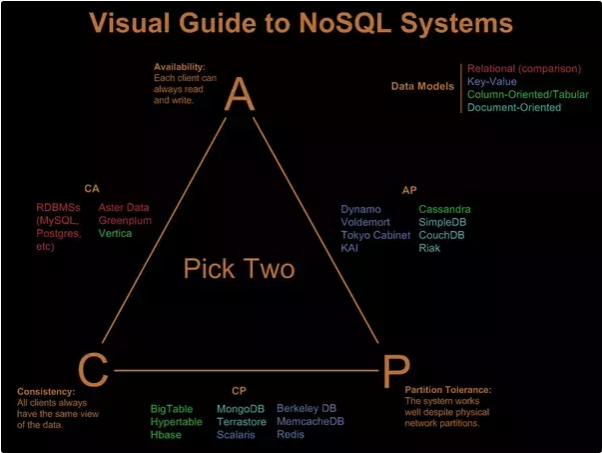

# Distributed System Concepts

## Database normalization

## Database sharding

## ACID and BASE

* ACID：Atomicity, Consistency, Isolation, Durability;
* BASE：Basically Available, Soft-state, Eventually Consistent

Databases are roughly divided into two types: ACID and BASE. Each type comes
with a different set of features, pros, and cons.

ACID databases are strict. Think of them as meticulous, no-nonsense librarians,
constantly making sure that all the books stay organized.

BASE databases are relaxed. Think of them as hands-off substitute teachers—keeping
things running but not maintaining strict classroom rules.

When the ACID and BASE acronyms are expanded out, they describe the technical
features each type of database provides.

ACID databases provide:

* Atomicity: database updates either happen completely, or they don't happen at
  all. (Books are either checked in to the library or checked out; they can't be
  in a weird in-between state.) Note the difference between Atomicity in a database
  system and atomic operation in concurrent programming.
* Consistency: rules in the database are always enforced. (All the books are
  shelved correctly and in order.) Consistency is a property of the application,
  while atomicity, isolation, and durability are properties of the database.
* Isolation: concurrent updates happen as if they ran one after the other.
  Formalized as serializability or linearizability in some textbooks.
  (e.g. Everybody is quiet in the library; no other patrons are distracting you.)
* Durability: once an update finishes, it stays in the database, even if
  something fails later on. In a single-node database, durability typically means
  that the data has been written to non-volatile storage such as a hard drive or
  SSD. In a replicated database, durability may mean that the data has been
  successfully copied to some number of nodes. (The library's records stick around
  even if the power goes out.)

BASE databases have fewer guarantees:

* Basically Available: the database usually works. (Class goes on as scheduled.)
* Soft State: different database replicas might not be in sync with each other.
  (Students can be working on different things at the same time.)
* Eventually Consistent: updates eventually make it to all replicas. (Someday
  students will figure out the lesson plan that should have been covered.)

ACID databases provide more features, so they're better, right?

Not necessarily.

All those features don't come for free. ACID databases are difficult to scale—if
your database is huge, it's expensive to ensure everything stays consistent.
It's especially tricky if your database spans multiple machines or data centers,
since all your machines will need to be kept in sync.

So, which type of database should you use? ACID or BASE?

It depends on what you need for the system you're building.

Does your system need consistency and data reliability? If so, go with an ACID
database. Does your system need to be distributed and highly available? Then a
BASE database may be a better choice.

## CAP Principle

* Consistency
* Availability
* Partition Tolerance

## Consistency model

1. Week consistent
    * Cache system
2. Eventually consistent
    * Mail, DNS, SMTP
3. Strong consistent
    * RDBMS

* [分布式系统的事务处理](https://coolshell.cn/articles/10910.html)
* [Google I/O 2009 - Transactions Across Datacenters](https://www.youtube.com/watch?v=srOgpXECblk&ab_channel=GoogleDevelopers)
* [Transaction Across DataCenter Slides](http://snarfed.org/transactions_across_datacenters_io.html)

## Consistent hashing

## Geo Hashing

* [Geospatial Performance Improvements in MongoDB 3.2](https://www.mongodb.com/blog/post/geospatial-performance-improvements-in-mongodb-3-2)

## Bloom filter

### Counting Bloom filter

## Count–min sketch

## Cuckoo filter

## Collaborate filtering

## Cassandra

## Dynamo

* [Dynamo: Amazon’s Highly Available Key-value Store]

## Memcached

## Redis

[Cassandra vs MongoDB vs CouchDB vs Redis vs Riak vs HBase vs Couchbase vs OrientDB vs Aerospike vs Neo4j vs Hypertable vs ElasticSearch vs Accumulo vs VoltDB vs Scalaris vs RethinkDB comparison](https://kkovacs.eu/cassandra-vs-mongodb-vs-couchdb-vs-redis)

## ZooKeepr

ZooKeeper is a centralized service for maintaining configuration information,
naming, providing distributed synchronization, and providing group services. For
example Rest.li use Zookeeper to store the DNS and the naming information for its
D2 (Dynamic Discovery).

Zookeeper store information that in less than 1M size. The service itself is
replicated over a set of machines that comprise the service. These machines
maintain an in-memory image of the data tree along with a transaction logs and
snapshots in a persistent store. Clients only connect to a single ZooKeeper
server. When a client first connects to the ZooKeeper service, the first
ZooKeeper server will setup a session for the client. If the client needs to
connect to another server, this session will get reestablished with the new server.

Read requests sent by a ZooKeeper client are processed locally at the ZooKeeper
server to which the client is connected. Write requests are forwarded to other
ZooKeeper servers and go through consensus before a response is generated. Sync
requests are also forwarded to another server, but do not actually go through
consensus to improve throughtput. Thus, the throughput of read requests **scales**
with the number of servers and the throughput of write requests **decreases**
with the number of servers.

* [Apache ZooKeeper Project Description](https://cwiki.apache.org/confluence/display/ZOOKEEPER/ProjectDescription)

## Kafka

* [The Log: What every software engineer should know about real-time data's unifying abstraction](https://engineering.linkedin.com/distributed-systems/log-what-every-software-engineer-should-know-about-real-time-datas-unifying)
* [Kafka Tutorial From Confluent](https://kafka-tutorials.confluent.io/)

## CouchDB

## Neo4j

## [k-d Tree](https://en.wikipedia.org/wiki/K-d_tree)

## Beam search

## A* search

## Minmax Algorithm

## Distributed System Design Process

0. scalability (vertical sharding, horizontal sharding)
1. fault tolerance (replication, auto failover)
2. consistency (choose consistency models, ACID v.s BASE)
3. performance (distributed cache system)
